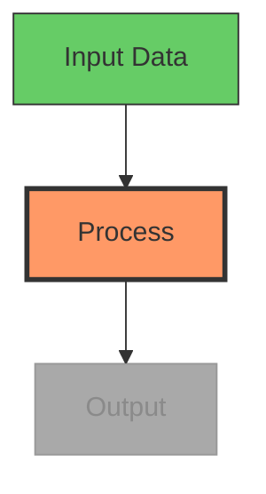

# Diagram Generation Usage for OpenMontage

> Sources: Mermaid.js documentation, existing Layer 3 skill at `.agents/skills/beautiful-mermaid/`,
> Mermaid-Sonar complexity analysis research, Mermaid GitHub issues #651 (scaling), #3029 (animation)

## Quick Reference Card

```
MAX NODES (1080p):  15-20 nodes, 20-25 edges
MAX NODES (4K):     25-35 nodes, 35-45 edges
MAX NODES (vert):   10-12 nodes, 12-15 edges
MIN FONT SIZE:      16px at 1080p, 14px at 4K
RENDER WIDTH:       Minimum 1200px
RENDER VIEWPORT:    3840x2160 (4K) for high-res PNG export
THEME (dark bg):    tokyo-night or dracula
THEME (light bg):   github-light or catppuccin-latte
```

## Diagram Type Selection

| Type | Video Suitability | Best For |
|------|------------------|----------|
| **Flowchart (TD)** | Excellent | Process flows, decision trees, algorithms |
| **Sequence diagram** | Good | API calls, user interactions, message flows |
| **State diagram** | Good | State machines, lifecycle, workflow status |
| **Class diagram** | Fair | Architecture (limit to 3-5 classes) |
| **ER diagram** | Poor for video | Too dense — simplify to key entities only |
| **Gantt chart** | Fair | Timelines, project phases |
| **Mindmap** | Good | Concept overviews, topic breakdowns |

**Default:** Use flowcharts (top-down `TD`) unless the content specifically requires another type. They read naturally and build well step by step.

## Complexity Limits for Video

Video is transient — viewers can't zoom or scroll. Cut complexity in half compared to static documentation.

| Target Resolution | Max Nodes | Max Edges | Min Font Size (CSS) |
|------------------|-----------|-----------|---------------------|
| 1920x1080 (HD) | 15-20 | 20-25 | 16px |
| 3840x2160 (4K) | 25-35 | 35-45 | 14px |
| 1080x1920 (vertical) | 10-12 | 12-15 | 18px |

**If your diagram exceeds these limits:** Split it into multiple frames, each showing a subset. This also creates a natural "building" animation for the video.

## Color Themes for Video

| Use Case | Theme | Why |
|----------|-------|-----|
| Dark video background | `tokyo-night` or `dracula` | High contrast, readable |
| Light video background | `github-light` or `catppuccin-latte` | Soft, professional |
| Code/developer content | `one-dark` | Familiar to dev audience |
| Maximum contrast | `zinc-dark` | Neutral, no color bias |
| Corporate/presentation | `nord-light` | Calm, professional |

**Match the playbook:** The diagram theme should complement the style playbook's color palette.

## Progressive Building for Video

Mermaid doesn't animate natively. Use progressive rendering to create a "building" effect:

### Approach: Multi-Stage Renders

1. Render diagram in stages — first 2 nodes, then 4, then full diagram
2. Each stage is a separate Mermaid render → SVG → PNG
3. Crossfade or cut between stages in FFmpeg
4. Viewers follow the logic step by step

### Highlighting Current Step

Use `classDef` to highlight the active node and dim completed ones:



Generate one PNG per step with different `classDef` assignments, then sequence them in the compose stage.

## Styling for Video Readability

### Node Sizing
- Minimum node width: 150px at 1080p
- Padding inside nodes: 15-20px
- Keep text to 3-5 words per node — use abbreviations if needed

### Edge Labels
- Keep to 1-2 words maximum
- Use edge labels only when the relationship isn't obvious from context
- Prefer labeled nodes over labeled edges

### Layout Direction
- **Top-down (TD):** Best for processes, hierarchies, flows
- **Left-right (LR):** Best for timelines, sequences, pipelines
- Avoid bottom-up (BT) — counterintuitive for most viewers

## Applying to OpenMontage

When using the `diagram_gen` tool:

1. **Check complexity** — max 15-20 nodes at 1080p. Split larger diagrams into multiple frames
2. **Choose theme** to match the video's style playbook and background
3. **Use progressive building** — render stages and crossfade for "building" effect in video
4. **Highlight with classDef** — show the current step in orange/red, completed in green, upcoming in grey
5. **Keep text minimal** — 3-5 words per node, 1-2 words per edge label
6. **Default to flowchart TD** unless the content specifically requires another diagram type
7. **Render at 4K viewport** (3840x2160) even for 1080p output — ensures crisp text when scaled
8. **Test readability** — view the rendered PNG at actual video frame size before composing
